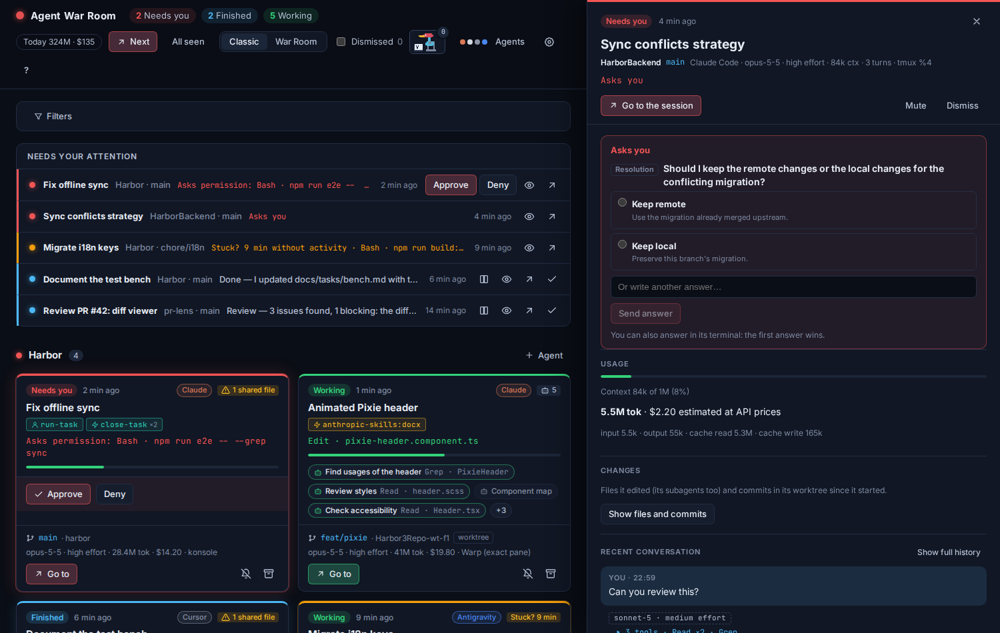
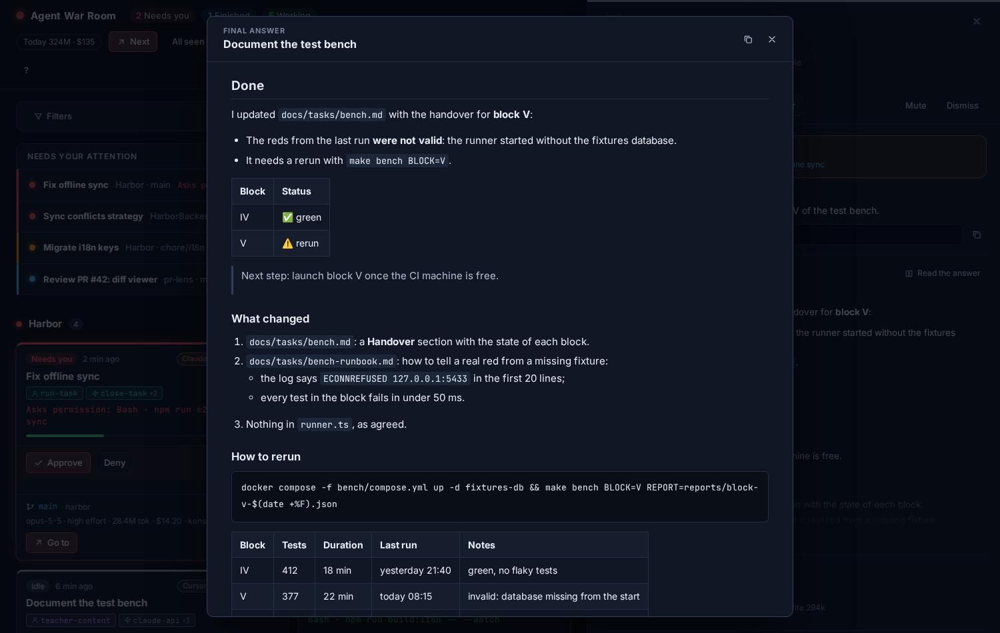
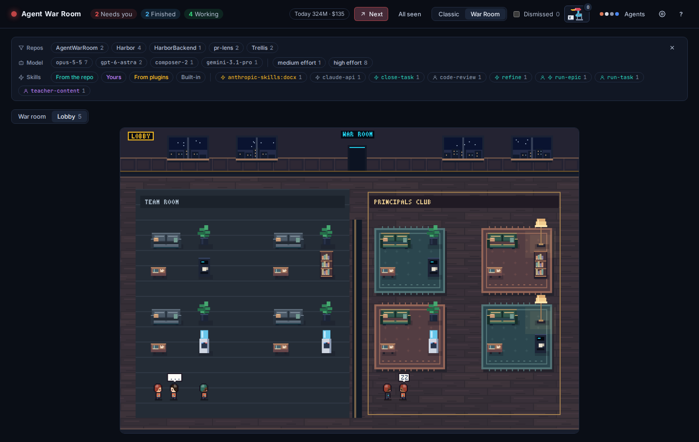

<div align="center">

<h1>Agent War Room</h1>
<p><strong>Mission control for your coding agents</strong></p>
<p>
Monitor <strong>Claude Code, Codex, Cursor and Antigravity</strong> across repositories, terminals
and IDEs from one local desktop app. See what needs you, what finished and what may be stuck—then
jump straight back into the right session.
</p>

</div>


Running several coding agents in parallel quickly turns attention—not compute—into the bottleneck.
Agent War Room gives every session a screen, groups it under its repository and lights it up only
when its state matters. The tray icon inherits the most urgent state in the room, so the app can
stay out of the way until something changes.

| | |
|---|---|
| **One room, four agents** | Claude Code, Codex, Cursor and Antigravity share the same view without hiding their differences. |
| **Attention, not noise** | Permissions, questions, completed turns and suspected stalls are ranked in one queue. |
| **Real session context** | Inspect the prompt, latest answer, conversation, tools, model, usage, subagents, skills and code changes. |
| **Jump back into the work** | Focus the session's window (KDE Plasma, macOS, Windows), its tmux pane or its Warp pane; reply from the room when the session supports it. |
| **Local by design** | No server and no account. Events and transcripts stay on your machine, and the app makes no network requests. |
| **Two interfaces** | Use compact cards or the pixel-art mission control; both are views of the same live state. |

> [!NOTE]
> Agent War Room runs on **Linux, macOS and Windows**. Fedora with KDE Plasma on Wayland is the
> primary tested environment; the macOS and Windows builds are linted, tested and packaged in CI but
> have seen little daily use yet (see [Platform support](#platform-support)).

## Contents

- [Why Agent War Room](#why-agent-war-room)
- [Quick start](#quick-start)
- [Visual tour](#visual-tour)
- [Daily workflow](#daily-workflow)
- [Installation](#installation)
- [Agent integrations](#agent-integrations)
- [Terminals and IDEs](#terminals-and-ides)
- [Languages](#languages)
- [Architecture](#architecture)
- [Data and privacy](#data-and-privacy)
- [Troubleshooting](#troubleshooting)
- [Development](#development)
- [For coding agents](#for-coding-agents)
- [Contributing](#contributing)
- [Limitations and roadmap](#limitations-and-roadmap)
- [License](#license)

## Why Agent War Room

Most agent tools are good at telling you what a single session is doing. The problem starts when
there are six of them: one is waiting for a permission, another finished ten minutes ago, a third
has stopped producing output, and each lives in a different terminal or IDE window.

Agent War Room turns those raw events into a small attention model:

1. **Needs you** comes first: permissions, questions and plan approvals.
2. **Finished** comes next: work that is ready for review.
3. **Stuck** highlights a session that has stayed active without a sign of life.
4. **Working**, **idle** and **closed** sessions remain visible without interrupting you.

The result is a single queue for human attention, not another transcript viewer. You can still open
the full session detail when you need evidence, and use **Next** to move through pending work in
order.

## Quick start

Agent War Room currently builds from source. You need Linux, macOS or Windows, Node.js 20 or newer,
Rust 1.95 or newer and the [Tauri 2 system dependencies](#requirements).

```sh
npm install
npm run app
```

Then:

1. Click **Connect** in the banner of each agent you use (Claude Code, Codex, Cursor or
   Antigravity). Codex asks you to trust the new hooks once the next time it opens.
2. Start a **new** agent session; sessions already running before connection are not discovered.
3. Leave Agent War Room in the tray. Its color changes when a session needs attention, finishes or
   appears stuck.

The connector creates a backup before editing an agent's hook configuration, and **Disconnect**
removes only the hooks installed by Agent War Room. See [Agent integrations](#agent-integrations)
for the exact behavior and limitations of each provider.

## Visual tour

### One room for every repository and session

The classic view keeps dense information scannable: repositories form groups, sessions become
cards, and subagents stay attached to the parent that launched them.


### Attention states

Every session has an attention level, from most to least urgent. The tray takes the color of the most
urgent one in the whole room.

| State | When | Notifies |
|---|---|---|
| 🔴 **Needs you** | Asks for a permission, asks you a question or waits for you to approve a plan | Yes |
| 🔵 **Finished** | Finished its turn and you have not looked at it yet | Yes |
| 🟠 **Stuck** | Has been "working" for 6 minutes without any sign of life (30 while a shell command runs) | Once |
| 🟢 **Working** | Running tools or thinking | No |
| ⚪ **Idle** / **Closed** | No turn in progress / process ended | No |

### The "Needs your attention" queue

At the very top: everything waiting for you across all repos, ordered by urgency and age. It can be
filtered by repo, by model and effort, by skill and by where the skill comes from; filters are
remembered.


### Answering from the room

When an agent asks you something, the preview shows the question with its options. Pick one or
write your own answer; you can still answer in the terminal, and the first answer wins.



### Session preview

Clicking a screen opens its detail, read from the transcript:

- Title, **initial request** (first prompt) and **the command it was launched with**.
- **Full last answer rendered as Markdown**, with an expanded view.
- Recent conversation with tools grouped, with the complete history available on demand, and the
  action in progress (`Bash · cargo test`).
- **Model and effort** of the session, of each subagent and of each answer.
- **Context used** (warns before it compacts), tokens and **estimated cost** at API prices,
  subagents included.
- **Skills** used, tagged by who launched them (you or the agent) and where they come from (the
  project, yours, a plugin or built in).


**Read the answer** opens a finished session's last answer at reading size, with tables, code and
lists rendered:



### Subagents

Subagents appear as small screens around their parent session, each with its own state. Click one
to see what it is doing, with which model and how much it has spent.


### A session's changes (on demand)

The **Changes** button shows the files the session edited (its subagents included) and the **commits
made in its worktree since it started**, with each one's diff. Nothing is computed until you ask.

**Two sessions on the same files.** When two live sessions of the same worktree edit the same file,
both cards say so ("1 shared file") and the preview lists the files with a link to the other session:
one may be overwriting the other's work. A worktree per session avoids it. (Claude Code and Codex.)


### The pixel-art War Room

The same state as a mission control. Each repo is a console ring with its sessions seated around it;
an agent raises its hand when it needs you, and the screen wall shows today's usage and what is
waiting. Idle agents walk through the door into the **lobby**, split into a team room and a
principals club, where they rest and chat until their next turn. Click an agent to open its preview;
in a busy repo, the cabinet of closed sessions opens the classic view filtered to that repo.



## Daily workflow

A typical loop is deliberately short: glance at the queue, open the oldest item that needs you,
act, and move on. The room keeps the session context close enough that you do not have to hunt for
the correct terminal first.

1. **Scan.** The tray and the queue show the most urgent state across every repository.
2. **Inspect.** Open the session preview for its request, latest answer, current tool and usage.
3. **Act.** Approve, reply or use **Go to** to return to the exact terminal or IDE window.
4. **Review.** Open **Changes** to inspect touched files, overlapping work and commits.
5. **Clear.** Dismiss completed work, mute noisy sessions or press **Next** for the next item.

### Navigation and interaction

- **Next.** Jumps to whatever has been waiting for you the longest: first what asks you for
  something, then what has finished. There is a button in the header, an entry in the tray menu and
  the `agent-war-room --next` command for a global shortcut (see
  [Global "next" shortcut](#global-next-shortcut-kde)).
- **Go to.** Takes you to the session's window: the exact Warp pane, the tmux pane, or on KDE the
  terminal or IDE window (WebStorm included, even with several projects open). See
  [Terminals and IDEs](#terminals-and-ides).
- **Approve or deny permissions from the room** or straight from the notification (Claude Code).
  Claude still shows its own dialog in the terminal: whoever answers first wins. Codex's requests are
  reported and answered in Codex (see [Codex](#codex)).
- **Yes to all.** The drinking bird in the lower-right corner repeatedly presses its pixel-art `Y`
  key while it automatically approves current and future Claude permissions. Its badge counts
  successful automatic approvals and pops a `+1` for each one. Click it again to stop; the mode is
  intentionally reset when the app restarts. Codex approvals still happen in Codex.
- **Reply and answer questions.** The room shows the agent's pending question and lets you write into
  the session when it runs in an app terminal or in tmux. The notifications' **Reply** button opens
  the preview with the cursor in the message box (Linux notifications do not support typing inside
  the notification).

### Session management

- **Launch and resume.** Start an agent in a repo, or resume a closed session, in a built-in terminal
  or in a Warp tab (see [Terminals and IDEs](#terminals-and-ides)).
- **Dismiss** (archive) a session even if it is still open: it stops notifying and leaves the room. It
  comes back on its own if you write to it, and can be restored for 3 days.
- **Mute**: still visible, but without notifications.
- **Today.** The header adds up the day's tokens and estimated cost across all sessions.
- **Two views of the same state:** the classic one (cards) and the pixel-art **War Room**, a mission
  control where each agent walks to its console when it works, raises its hand when it needs you and
  goes down to the lobby when it is idle; its shirt says which agent it is (Claude orange, Codex
  white, Cursor charcoal, Antigravity blue). Usage is drawn: context fill on each monitor, token and
  cost bars on each console, totals per repo and for today on the screen wall; running subagents show
  what they are doing. Busy repos fold their closed sessions into a cabinet. Switch from the header.

On Linux, desktop notifications come with buttons: **View**, **Go to**, **Approve** and **Reply**.
On macOS and Windows they are plain notices (their notification APIs as used here take no buttons):
the tray and the window carry those actions. The first agent's menu in the header also has **Open at login (in the tray)**, which starts the app
hidden in the tray.

### Global "next" shortcut

On KDE: System Settings → Keyboard → Shortcuts → Add New → Command or Script: `agent-war-room --next`
(or the binary's path if it is not installed), and bind it to a key. On macOS or Windows, bind the
same command with any launcher that runs commands (Shortcuts, Raycast, PowerToys…).

With the app open, the shortcut jumps to the window of the session that has been waiting the longest;
if it cannot find the window, it opens its preview. If the app is not running, it starts it.

## Installation

There are no prebuilt releases yet: you build Agent War Room from source, either to run it in
development mode or to produce an installable package. Both paths use [Tauri 2](https://tauri.app),
which compiles the Rust core into a native binary and embeds the React front end in the system
WebView (WebKitGTK on Linux, WKWebView on macOS, WebView2 on Windows).

### Platform support

| Platform | Packages | Status |
|---|---|---|
| **Linux** (x86_64) | `.deb`, `.rpm`, AppImage | Supported and used daily on Fedora with KDE Plasma (Wayland). |
| **macOS** (Apple silicon and Intel) | `.app`, `.dmg` | Builds and passes the test suite in CI; little real-world use yet. Bundles are unsigned. |
| **Windows** 10/11 | `.msi`, `-setup.exe` | Builds and passes the test suite in CI; little real-world use yet. Bundles are unsigned. |

What differs between them:

| | Linux | macOS | Windows |
|---|---|---|---|
| Bridge → app | Unix socket | Unix socket | named pipe |
| Process lookup (liveness, terminal/IDE) | `/proc` | system process table | system process table |
| **Go to** a window | KDE Plasma (KWin) | brings the terminal or IDE app forward | raises the exact top-level window |
| tmux (go to and type) | yes | yes | no (tmux does not run natively) |
| Notification buttons | yes | no | no |
| Agents started from the room | login shell (`$SHELL -l`) | login shell (`$SHELL -l`) | `cmd /C` |

Tauri does not cross-compile desktop bundles reliably: build each platform's packages **on that
platform**. The CI workflow does this for all three (see [Build an installable package](#build-an-installable-package)).

### Requirements

**Toolchains**

- [Rust](https://rustup.rs) stable, 1.95 or newer (the workspace uses the 2024 edition).
- [Node.js](https://nodejs.org) 20 or newer, with npm.
- A C toolchain: SQLite is compiled from source through `rusqlite`'s `bundled` feature.
  - Linux: gcc or clang, `make`, `pkg-config` (Tauri also links against GTK and WebKitGTK, below).
  - macOS: Xcode Command Line Tools (`xcode-select --install`).
  - Windows: Visual Studio Build Tools with "Desktop development with C++". WebView2 ships with
    Windows 10/11.

**System libraries (Tauri 2 on Linux)**

Fedora:

```sh
sudo dnf install webkit2gtk4.1-devel openssl-devel curl wget file \
  libappindicator-gtk3-devel librsvg2-devel libxdo-devel
sudo dnf group install "c-development"
```

Debian or Ubuntu (22.04 or newer):

```sh
sudo apt install libwebkit2gtk-4.1-dev build-essential curl wget file \
  libxdo-dev libssl-dev libayatana-appindicator3-dev librsvg2-dev
```

Arch Linux:

```sh
sudo pacman -S --needed webkit2gtk-4.1 base-devel curl wget file openssl \
  appmenu-gtk-module libappindicator-gtk3 librsvg xdotool
```

Other distributions: see Tauri's [Linux prerequisites](https://v2.tauri.app/start/prerequisites/#linux).

**Runtime tools (optional, used when present)**

| Tool | Used for |
|---|---|
| `git` | A session's commit list and diffs in **Changes**. |
| `tmux` (Linux, macOS) | Writing into sessions and **Go to** inside tmux. |
| [Warp](https://www.warp.dev/) | Launching sessions in Warp tabs and per-pane **Go to**. |
| `busctl` (systemd) + KDE Plasma (Linux) | Per-window **Go to** through KWin. macOS and Windows need nothing extra. |
| `xdg-open` (xdg-utils, Linux) | Opening links (`open` on macOS, the URL handler on Windows). |
| A notification daemon (Linux) | Desktop notifications and their buttons (any freedesktop one; Plasma ships it). |

### Run from source (development)

From a clone of the repository:

```sh
npm install
npm run app
```

`npm run app` does two things:

1. `npm run bridge` builds the hook bridge in debug mode (`cargo build -p warroom-hook`).
2. `tauri dev` starts Vite on `http://localhost:1420`, compiles the Rust app and opens the window
   with hot reload for the front end. Rust changes trigger a rebuild and restart.

The first build downloads and compiles every Rust crate and takes a few minutes; later ones are
incremental. To work on the UI only, `npm run dev` serves it in a browser with a demo room and no
Rust at all.

### Build an installable package

```sh
npm install
npm run package
```

`npm run package` runs two steps, on any of the three systems:

1. **Sidecar** (`scripts/sidecar.mjs`): builds `warroom-hook` in release mode and copies it to
   `src-tauri/binaries/warroom-hook-<target-triple>` (for example
   `warroom-hook-x86_64-unknown-linux-gnu`, or `…-x86_64-pc-windows-msvc.exe`), the name Tauri
   expects for bundled binaries.
2. **Bundle**: `tauri build --config src-tauri/tauri.bundle.conf.json` builds the front end
   (`tsc && vite build` into `dist/`), compiles the app in release mode and produces every package
   format of the current OS. The extra config adds the bridge as an `externalBin`, so each package
   ships `warroom-hook` next to the app binary (`/usr/bin/` in the `.deb` and `.rpm`).

The results land in `target/release/bundle/`:

| OS | Output |
|---|---|
| Linux | `deb/…_amd64.deb`, `rpm/…x86_64.rpm`, `appimage/…_amd64.AppImage` |
| macOS | `macos/Agent War Room.app`, `dmg/Agent War Room_0.1.0_aarch64.dmg` |
| Windows | `msi/Agent War Room_0.1.0_x64_en-US.msi`, `nsis/Agent War Room_0.1.0_x64-setup.exe` |

Arguments after `--` go to `tauri build`. Useful ones:

```sh
npm run package -- --bundles rpm        # only one format (deb, rpm, appimage, app, dmg, msi, nsis)
npm run package -- --bundles deb,rpm    # several
npm run package -- --no-bundle          # just the binary in target/release/
npm run package -- --debug              # debug build, bundles in target/debug/bundle/
npm run package -- --verbose            # see what the bundler is doing
```

Without a machine of each OS, the CI workflow (`.github/workflows/ci.yml`) builds them all: run it
by hand (**Actions → ci → Run workflow**) or push a `v*` tag, and download the installers from the
run's artifacts.

### Install the package

**Linux**

```sh
sudo dnf install ./target/release/bundle/rpm/*.rpm     # Fedora, openSUSE…
sudo apt install ./target/release/bundle/deb/*.deb     # Debian, Ubuntu…
```

The `.deb` and `.rpm` declare their runtime dependencies (WebKitGTK, GTK, AppIndicator), so the
package manager pulls them in. After installing, `agent-war-room` is on your `PATH` and the app
appears in the application menu.

The AppImage bundles its libraries and needs no installation:

```sh
chmod +x "target/release/bundle/appimage/Agent War Room_0.1.0_amd64.AppImage"
"./target/release/bundle/appimage/Agent War Room_0.1.0_amd64.AppImage"
```

AppImages need FUSE 2 to mount themselves (`fuse-libs` on Fedora, `libfuse2` on Debian/Ubuntu).

**macOS**: open the `.dmg` and drag the app to Applications. The bundle is not signed or notarized,
so the first time macOS refuses to open it: right-click the app → **Open**, or allow it in System
Settings → Privacy & Security.

**Windows**: run the `-setup.exe` or the `.msi`. The installer is not signed, so SmartScreen warns:
**More info → Run anyway**.

When you connect an agent, the app copies the bridge into its data folder (`bin/` under the paths in
[Data and privacy](#data-and-privacy)) and points the hooks there, so updating or moving the package
does not break existing hooks; reconnect after an update to refresh that copy.

## Agent integrations

The app shows a banner for each supported agent it finds on your machine (`~/.claude`, `~/.codex`,
`~/.cursor`, `~/.gemini/config`) that is not connected yet. They all use the same bridge; each gets
hooks in its own configuration.

| | States | Approve from the room | Model / tokens | Cost | Start / resume from the room |
|---|---|---|---|---|---|
| Claude Code | full | yes | yes | estimated | yes |
| Codex | full | no (answer in Codex) | yes | no price | yes |
| Cursor | no "needs you" | no | yes (from its hooks) | no price | yes (`cursor-agent`) |
| Antigravity | working / finished | no | model only | no | no (only inside its app) |

### Claude Code

Click **Connect Claude Code**. It:

- Adds hooks to `~/.claude/settings.json` without touching yours, saving a
  `settings.json.warroom-bak` copy first.
- Points them at `~/.local/share/agent-war-room/bin/warroom-hook`, a stable copy of the bridge.
- Registers the `SessionStart`, `SessionEnd`, `UserPromptSubmit`, `PreToolUse`, `PostToolUse`,
  `PostToolUseFailure`, `PermissionRequest`, `Notification`, `Stop`, `SubagentStart`,
  `SubagentStop` and `PreCompact` events.

Only sessions started afterwards are connected. **Disconnect**, in the agent's menu in the header,
removes exactly those hooks and leaves the rest as it was.

### Codex

Click **Connect Codex**. It adds the same kind of hooks to `$CODEX_HOME/hooks.json` (`~/.codex` by
default), with its own `.warroom-bak` copy. Then:

- **Trust the hooks once.** The next time you open Codex it says *Hooks need review*: choose **Trust
  all and continue**. Until then Codex does not run them (and `codex exec` never asks, so it skips
  them).
- **Approvals are answered in Codex.** Codex shows its permission dialog only after the hook returns,
  so the room does not hold it: you get the red screen and the notification, and you answer in Codex
  (**Go to** takes you there). With Claude Code you can also approve from the room.
- **Cost is not estimated.** Codex's models have no public per-token price the app knows, so it shows
  tokens and context but no dollar figure.

Everything else works the same: states, queue, preview, subagents, skills (`$name`), model and
effort, context, changes and commits, "Next", launching and resuming (`codex resume`).

### Cursor

Click **Connect Cursor**. It adds hooks to `~/.cursor/hooks.json` (with a `.warroom-bak` copy). They
cover the Cursor app's agent and `cursor-agent` in a terminal.

- Cursor **also runs Claude Code's hooks**. If both integrations are connected it notices our command
  twice and runs it once, so nothing arrives duplicated.
- Its transcripts carry no model or tokens, so those come from its hooks (`afterAgentResponse`) and
  only for turns that happen while the app is running.
- It doesn't report when it is waiting for your approval, so Cursor sessions don't turn red.

### Antigravity

Click **Connect Antigravity**. It adds one named block (`agent-war-room`) to its global
`~/.gemini/config/hooks.json`, with a `.warroom-bak` copy.

- Its hooks run inside its agent loop and don't say when a conversation starts or ends: a
  conversation appears with its first model call and finishes at each `Stop`.
- No approvals and no tokens (only the model), and it can't be started from the room: it lives in
  its own app.

Cursor and Antigravity are built from their own hook contracts and real transcripts, but have **not
been tried live** yet (see [Limitations](#limitations-and-roadmap)).

## Terminals and IDEs

Agent War Room does not care where an agent runs: an app terminal, tmux, Warp, Konsole, or the
built-in terminal of an IDE such as WebStorm. Every hook event carries where it came from (the
process chain up to the terminal or IDE, the tmux pane, the Warp pane), and **Go to** uses the most
precise route available, in this order: Warp pane → tmux pane → the window of the terminal or IDE.

| Where the agent runs | Go to | Type and answer from the room | Start / resume from the room |
|---|---|---|---|
| App terminal (built in) | opens it inside the room | yes | yes |
| tmux (inside any terminal; Linux, macOS) | exact pane, and raises its terminal | yes | no |
| Warp | exact tab and pane | no | yes (new tab) |
| Any other terminal or IDE (Konsole, Terminal, Windows Terminal, WebStorm, VS Code…) | its window (KDE, macOS, Windows) | no | no |

### App terminal

The room has its own terminals (xterm.js on a real PTY), so you can work without leaving it.

- Each repository has a **+ Agent** button; with several agents connected it opens a menu of agent ×
  terminal ("Claude Code · app terminal", "Codex · Warp tab"…). Closed sessions offer **Resume in an
  app terminal**, which runs the resume command in the session's exact folder.
- The agent starts through your login shell, so it finds the same `PATH` as in a normal terminal
  (on Windows, through `cmd`, which finds both `claude.exe` and npm's `claude.cmd`).
- Sessions started this way get a terminal button on their card and in the preview. Closing the
  window keeps the terminals alive: the app stays in the tray, and reopening a terminal brings back
  its recent output.
- Replies and answers typed in the room are written straight into the terminal.

### tmux

Nothing to set up: when an agent runs inside tmux, the bridge records the pane and the tmux server.

- **Go to** selects the pane, switches the attached client to its session if needed and raises the
  terminal window that shows it.
- Replies from the room are typed into the pane with `tmux send-keys`, so tmux is the way to answer
  from the room for agents started in any external terminal.

### Any terminal or IDE

**Go to** reaches the window of whatever runs the agent: Konsole, Kitty, Terminal, iTerm2, Windows
Terminal, the terminal of WebStorm or another JetBrains IDE, VS Code, Cursor… The bridge walks the
process table from the agent up to its terminal or IDE, and then:

- **KDE Plasma**: a small KWin script activates the right window (on Wayland only the compositor may
  hand focus to another app). It restores minimized windows and switches virtual desktops if needed.
  Other Linux desktops (GNOME, generic X11) are not supported yet: Warp and tmux still work there.
- **macOS**: the terminal or IDE app comes to the front with its windows. It needs no permission,
  but it cannot pick one window among several of the same app.
- **Windows**: the exact top-level window is restored and brought to the front.

One process often owns several windows: a single WebStorm can have five projects open, and Warp or
Konsole can have several windows. On KDE and Windows the window title breaks the tie: the room looks for the session
title, then its worktree folder, then the repository name, and prefers whole-word matches (so
`Harbor` does not pick `Harbor3Repo`). IDEs put the project name in the title, so this usually just
works; if it lands on the wrong window, make the repository name visible in the window title.

These sessions cannot be typed into from the room: use **Go to** and answer there, or run the agent
inside tmux.

### Warp

[Warp](https://www.warp.dev/) gets the most precise jump, and works on any desktop.

- **Go to the exact pane.** Warp sets `WARP_FOCUS_URL` in every pane, and the bridge records it with
  each event. **Go to** opens that link, so Warp brings up the exact tab and pane the agent runs in,
  even with many tabs open. The Warp window is raised too (on KDE without KWin, Wayland may only
  flash the taskbar entry).
- **Start an agent in a Warp tab.** Each repository has a **+ in Warp** button (with several agents
  connected, the **+ Agent** menu offers "<agent> · Warp tab"). The new tab opens in the repository
  folder, already running the agent, and is named "War Room · <label>".
- **Resume a closed session in Warp.** Closed cards and the session preview offer **Resume in Warp**,
  which runs the agent's resume command (`claude --resume`, `codex resume`…) in a new tab.

How it works: Warp's URIs cannot run commands, but its tab configs can. The app writes one
(`awr-<id>.toml`) into Warp's tab config folder (`~/.local/share/warp-terminal/tab_configs/` on
Linux, `~/.warp/tab_configs/` on macOS, `%APPDATA%\warp\Warp\data\tab_configs\` on Windows; the
last two follow Warp's layout for launch configurations and are not verified) with the folder and the command,
then opens `warp://tab_config/awr-<id>`. It only ever touches files with the `awr-` prefix, and
deletes them after 24 hours.

Limits: the room cannot type into a Warp pane, so to reply you use **Go to** and answer in Warp
(typing from the room works in app terminals and tmux). Whether Warp picks up a freshly written
tab config without restarting has not been verified live yet.

## Languages

The app speaks English and Spanish. Choose one under **Options → Language**; the choice is remembered
for the window, tray and notifications, and passed as `AWR_LANG` to agents launched or resumed from the war room.
Without a saved choice it follows your system language (`LANG`/`LC_*`), and anything other than
Spanish falls back to English. To force the initial choice, start it with `AWR_LANG=es` (or `en`).

All text lives in the catalogs `locales/<lang>.json`, shared by the Rust core and the front. To add a
language, copy `locales/en.json`, translate the values and register the code (see
[`.cursor/rules/i18n.mdc`](.cursor/rules/i18n.mdc)); `cargo test -p awr-i18n` checks it has every key
and the same placeholders. Preview it with `npm run shot -- /tmp/shots 1500 <code>`.

## Architecture

Agent War Room is a Tauri 2 desktop application with a Rust core, a React and TypeScript front end,
SQLite persistence and a small Rust hook bridge. The bridge is intentionally disposable from the
agent's point of view: if the app is not running, it exits immediately and never blocks the session.

```text
 Claude Code ─┐
 Codex ───────┤
 Cursor ──────┤
 Antigravity ─┴hook──▶ warroom-hook ──socket/pipe──▶ Agent War Room (Tauri)
   (each event)        (bridge, Rust)                 ├─ Rust core (hexagonal)
                        · walks the process table      │   domain ─ application ─ infrastructure
                          up to the terminal/IDE       ├─ SQLite: append-only events
                        · collects TMUX, WARP_*, …     ├─ incremental transcript reading
                        · always exits 0               └─ React UI: classic and pixel-art views
```

1. The agent runs `warroom-hook` on every event; all four agents share the same bridge. The bridge
   works out which agent it is and where the session runs (process, terminal, tmux or Warp pane) and
   sends an envelope to the app's socket (a named pipe on Windows). If the app is not there, it
   exits at once.
2. For Claude's `PermissionRequest`, the bridge waits for the room's decision (up to ~10 minutes). If
   you answer in the terminal, Claude kills the hook and the room notices.
3. The app stores every event in SQLite and recomputes the session's state. The domain is pure: one
   state machine per session that decides its attention level.
4. In parallel it reads the agent's transcript incrementally (Claude's JSONL, Codex's rollout,
   Cursor's and Antigravity's own formats) for the title, answers, model, skills, subagents, usage
   and touched files.
5. The UI receives a precomputed view; the TypeScript types are generated from Rust with `ts-rs`.

The project is split like this:

| Crate / folder | Contents |
|---|---|
| `crates/domain` | Sessions, states, attention, subagents, skills. No dependencies but serde. |
| `crates/application` | Use cases (`WarRoomService`), ports and the view the UI consumes. |
| `crates/infrastructure` | Adapters: the shared hook protocol, installer and JSONL reading; `claude/`, `codex/`, `cursor/`, `antigravity/` (hook translation, transcripts, prices); SQLite, socket/pipe, window focus per OS (KWin, macOS, Windows), tmux, Warp, PTYs, git. |
| `crates/wire` | Protocol between the bridge and the app. |
| `crates/procs` | The OS process table (name, parent, command line, liveness): `/proc` on Linux, `sysinfo` on macOS and Windows. |
| `crates/i18n` | Translation lookup over `locales/<lang>.json` (the front reads the same catalogs). |
| `crates/hook-bridge` | The `warroom-hook` binary. |
| `src-tauri` | Composition, commands and events, tray, notifications, `--next`, autostart. |
| `src` | Layered React: domain, application, infrastructure (Tauri or demo) and UI. |

Each agent is a bundle of adapters (`AgentPorts`: hook translation, transcript reader, skill folders)
behind ports; the domain and use cases do not know which agent they are watching. Adding Codex,
Cursor and Antigravity took one domain event (`Interrupted`) and one port change (hooks may bring
model and tokens, `HookFacts`); the bridge, socket, installer, JSONL reading and UI are shared. The
skill `add-provider` describes how to add the next one.

The same layering is what makes the app portable: the domain and use cases contain no
OS-specific code at all. Everything that differs between Linux, macOS and Windows (transport,
process lookup, window focus, notifications, launch shell) is an adapter picked at compile time.
Decisions and alternatives in [`docs/adr/0001-architecture.md`](docs/adr/0001-architecture.md) and
[`docs/adr/0002-cross-platform.md`](docs/adr/0002-cross-platform.md).

## Data and privacy

Everything stays on your machine; the app makes no network requests.

The app's data folder (`<data>` below) is `~/.local/share/agent-war-room` on Linux,
`~/Library/Application Support/agent-war-room` on macOS and `%APPDATA%\agent-war-room` on Windows.

| What | Where |
|---|---|
| Events (append-only, 14 days) | `<data>/events.db` |
| Installed bridge | `<data>/bin/warroom-hook` (`warroom-hook.exe` on Windows) |
| Socket (`0700` permissions) | `$XDG_RUNTIME_DIR/agent-war-room/ingress.sock` on Linux, `$TMPDIR/agent-war-room-$USER/ingress.sock` on macOS; a named pipe for your user on Windows |
| Warp tab configs (only when you launch in Warp) | see [Warp](#warp) |
| Added hooks | `~/.claude/settings.json`, `$CODEX_HOME/hooks.json`, `~/.cursor/hooks.json`, `~/.gemini/config/hooks.json` (copies in `.warroom-bak`) |

The app **reads** the transcripts in `~/.claude/projects/`, `~/.codex/sessions/` (plus Codex's
`session_index.jsonl` for titles), `~/.cursor/projects/*/agent-transcripts/` and
`~/.gemini/antigravity/brain/`, the system process table (to locate processes and windows) and, when you click
**Changes**, the `git log` of the session's worktree. It only **writes** into your sessions when you
reply or approve something from the room.

The cost is an **estimate** at public API prices: on a subscription it is not what you pay, but it is
useful to compare sessions.

## Troubleshooting

| Symptom | What to check |
|---|---|
| A session does not show up | Only sessions started after connecting show up. Check that the agent's menu says "connected" and start a new session. |
| Codex sessions never show up | Codex runs the hooks only after you trust them: open Codex and choose **Trust all and continue**. `codex exec` never asks, so it skips them. |
| It shows up but without title or answers | Claude launched from inside another Claude session inherits `CLAUDE_CODE_*` variables that disable the transcript. Launch it from a clean terminal (launches from the app already scrub them). |
| "Go to" does nothing or picks the wrong window | On Linux outside KDE only Warp and tmux work. With several windows of the same terminal or IDE, the window title breaks the tie on KDE and Windows (having the repo name in it helps); macOS brings the whole app forward (see [Terminals and IDEs](#terminals-and-ides)). |
| I cannot write into a session | Only possible when it runs in an app terminal or in tmux; elsewhere use **Go to**. |
| No notifications | Check that the session is not muted or dismissed and that the desktop allows the app's notifications. |
| I want to see what an agent sends | Start the agent with `WARROOM_HOOK_DUMP=/path/file.jsonl`: the bridge saves every envelope. |

## Development

```sh
scripts/check.sh           # checks only what changed vs HEAD, with minimal output
scripts/check.sh all       # everything: clippy, tests, tsc, vitest, build and agent docs
scripts/cross_check.sh     # clippy for Windows and macOS from Linux (needs zig: pip install ziglang)
cargo test --workspace     # domain, use cases and adapters; regenerates src/domain/generated
npm test                   # front (Vitest)
npm run shot -- /tmp/shots # screenshots of the demo UI (the ones in docs/screenshots)
```

CI (`.github/workflows/ci.yml`) runs clippy, the Rust tests and the front checks on Linux, macOS and
Windows for every push and pull request.

Outside Tauri (`npm run dev` in the browser), the UI uses a demo room with 5 repos and 11 sessions.
Handy for designing without the app or real agents.

End-to-end tests against a real Claude Code and a real Codex. They are isolated (their own socket,
folder and tmux, and for Codex its own `CODEX_HOME` with only your login copied in, without touching
your configuration) and cost one short call each:

```sh
cargo build -p warroom-hook
cargo test -p awr-infrastructure --test claude_e2e -- --ignored --nocapture
cargo test -p awr-infrastructure --test codex_e2e -- --ignored --nocapture
cargo test -p awr-infrastructure --test bridge_e2e -- --ignored   # Cursor/Antigravity payloads, no agent
```

Manual tests against the desktop:

```sh
cargo test -p awr-infrastructure kwin_live -- --ignored
AWR_TRANSCRIPT=/path/session.jsonl cargo test -p awr-infrastructure transcript_live -- --ignored --nocapture
```

Conventions: code, docs and commits in English; conventional commits. User-visible text never lives
in code: it is a key in the translation catalogs `locales/<lang>.json`, shared by the Rust core and the
front.

## For coding agents

The project ships documentation meant for agents (Claude Code, Cursor, Codex…), organized to spend
little context: the agent loads a short index and opens only what it needs.

- **[`AGENTS.md`](AGENTS.md)** is the single entry point: invariants, a "what to read for what you are
  about to do" table and another one by area. It holds no knowledge, it only says where it is.
- **`.cursor/rules/`** stores the knowledge in two levels. *Routers* (`*.mdc`) are tied to code paths
  through `globs`. *Leaves* (`*.md`) are only opened when their trigger, in the router's table,
  matches the task.
- **Rules hook.** In Claude Code, when a file is read or edited, a hook announces once per session
  which rule covers it (and its sections, if it is long). In any tool:
  `python3 scripts/rules_for_path.py <file>`.
- **`.agents/skills/`** holds step-by-step procedures (`verify`, `extend-session-model`,
  `add-provider`, `e2e`, `close-task`, `anti-rot`).
- **`.agents/agents/`** holds subagents that read a lot and return little (transcripts, screenshots,
  review). `.claude/skills` and `.claude/agents` are links to these folders.
- **Anti-rot.** `python3 scripts/check_docs.py` (also `scripts/check.sh docs`) catches dead paths,
  unreachable rules, orphan leaves, globs without files and oversized documents. The `anti-rot` skill
  covers what needs judgement.
- Agents work in English in the repo but **reply to you in your language**.

What each tool loads and what is lost outside Claude Code: [`.agents/README.md`](.agents/README.md).

## Contributing

Issues and pull requests are welcome.

- Before opening a PR, run `scripts/check.sh all` and, for UI changes, `npm run shot -- <dir>` and
  look at the screenshots.
- If you work with a coding agent, point it at [`AGENTS.md`](AGENTS.md): it routes it to the right
  rules and skills, and the `close-task` skill covers checks and commits.
- New or changed text goes into every `locales/*.json`, never inline in code.
- If you change something the agent docs cite, update them in the same PR
  (`python3 scripts/check_docs.py`).

## Limitations and roadmap

- Supported: Claude Code, Codex, Cursor and Antigravity. Others (Gemini CLI, opencode…) follow the
  skill `add-provider`.
- Cursor and Antigravity: built from their contracts and real transcripts, and tested through the
  real bridge (`bridge_e2e.rs`), but not yet against a live Cursor or Antigravity session.
- Codex: approvals are answered in Codex, not from the room; no cost estimate; tested with Codex CLI
  0.154.
- Per-window "Go to" on Linux only on KDE (KWin); GNOME and generic X11 are not done. On macOS it
  brings the whole app forward rather than one of its windows.
- macOS and Windows are verified in CI (lint, tests, packaging), not yet by daily use: window focus,
  the hook command on Windows (run by the agent's shell) and Warp's folders there may need fixes once
  tried on a real desktop. The bundles are unsigned.
- Not verified live: notification buttons, the `--next` shortcut, autostart, the installed RPM
  package and Warp picking up the generated tabs.
- The cost depends on a price table in the code (`claude/pricing.rs`); a new model without a price
  shows no cost.
- No web version: the browser UI is only the demo.

## License

MIT — see [LICENSE](LICENSE).
