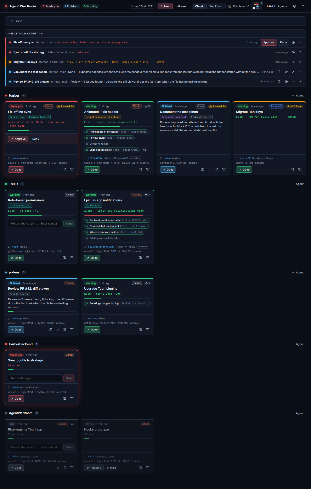
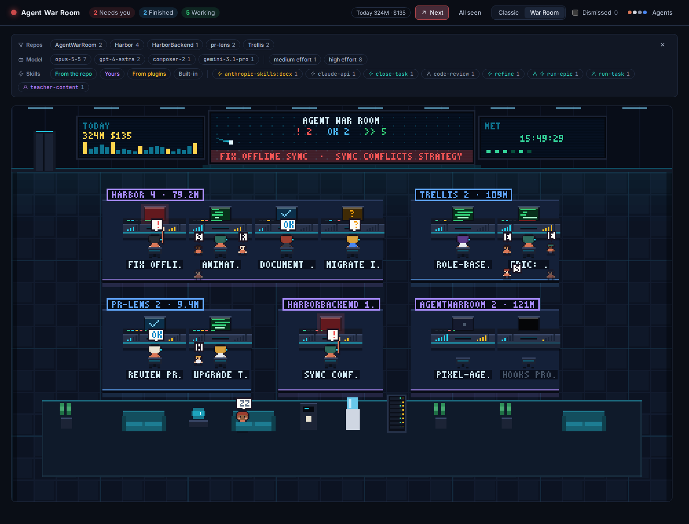
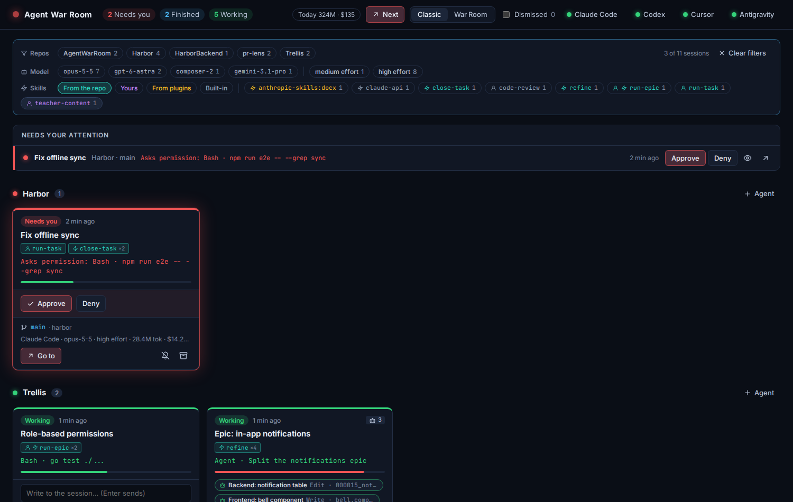
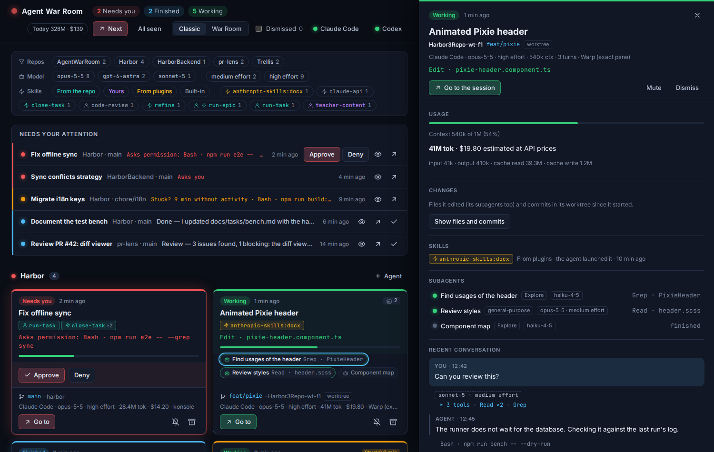
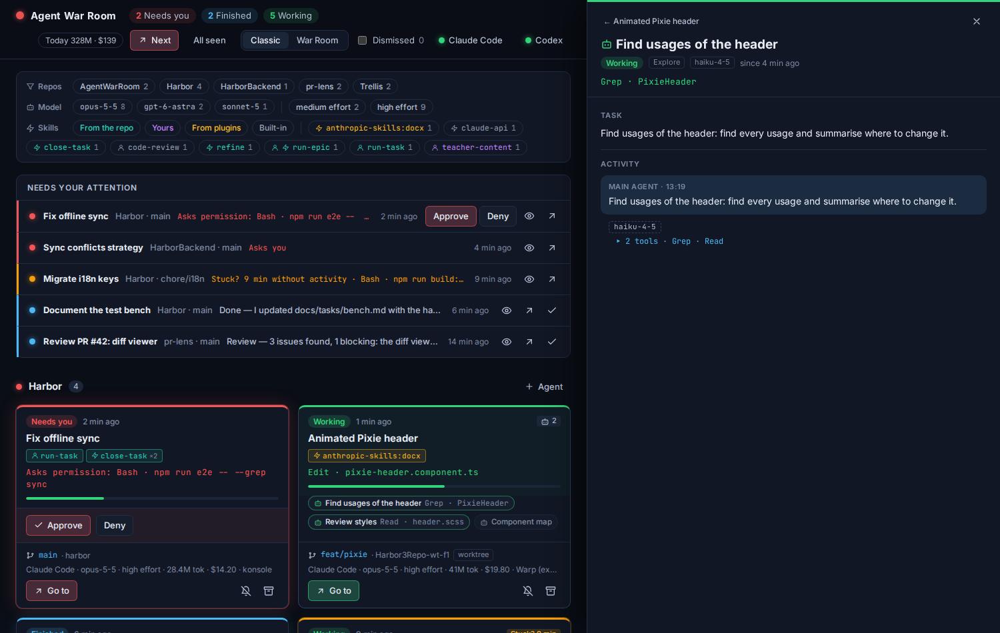
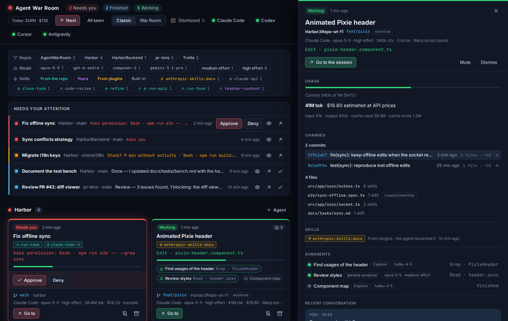
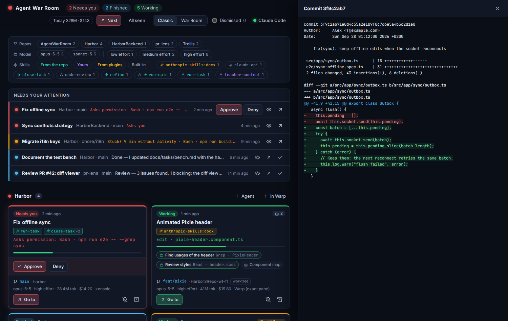

# Agent War Room

A control room for your coding agents: **Claude Code, Codex, Cursor and Antigravity**. If you run several agent sessions
at once, spread across repos, terminals and IDE windows, you end up losing track of which one is
waiting for you. Agent War Room shows **one screen per session, grouped by repository**, that lights up
when something needs you, when it finishes or when it looks stuck. It lives in the system tray: you
only look at it when it changes color.





- **Fully local.** No server, no account: it reads the agents' hooks and transcripts on your
  machine.
- **Never gets in the agent's way.** If the app is closed, the hook bridge exits immediately and
  the agent carries on as if nothing happened.
- **Linux first** (KDE Plasma on Wayland is the tested environment). The core is Rust and the UI is
  React on Tauri 2.

## Contents

- [What you see](#what-you-see)
- [Usage guide](#usage-guide)
- [Installation](#installation)
- [Connecting your agents](#connecting-your-agents)
- [Languages](#languages)
- [How it works](#how-it-works)
- [Data and privacy](#data-and-privacy)
- [Troubleshooting](#troubleshooting)
- [Development](#development)
- [For coding agents](#for-coding-agents)
- [Contributing](#contributing)
- [Limitations and roadmap](#limitations-and-roadmap)
- [License](#license)

## What you see

### States

Every session has an attention level, from most to least urgent. The tray takes the color of the most
urgent one in the whole room.

| State | When | Notifies |
|---|---|---|
| 🔴 **Needs you** | Asks for a permission, asks you a question or waits for you to approve a plan | Yes |
| 🔵 **Finished** | Finished its turn and you have not looked at it yet | Yes |
| 🟠 **Stuck** | Has been "working" for 6 minutes without any sign of life (30 while a shell command runs) | Once |
| 🟢 **Working** | Running tools or thinking | No |
| ⚪ **Idle** / **Closed** | No turn in progress / process ended | No |

### The "Needs your attention" queue

At the very top: everything waiting for you across all repos, ordered by urgency and age. It can be
filtered by repo, by skill and by where the skill comes from; filters are remembered.



### Session preview

Clicking a screen opens its detail, read from the transcript:

- Title, **initial request** (first prompt) and **the command it was launched with**.
- **Full last answer rendered as Markdown**, with an expanded view.
- Recent conversation with tools grouped, and the action in progress (`Bash · cargo test`).
- **Model and effort** of the session, of each subagent and of each answer.
- **Context used** (warns before it compacts), tokens and **estimated cost** at API prices,
  subagents included.
- **Skills** used, tagged by who launched them (you or the agent) and where they come from (the
  project, yours, a plugin or built in).



### Subagents

Subagents appear in small around their session, with their own state. Click one to see what it is
doing, with which model and how much it has spent.



### A session's changes (on demand)

The **Changes** button shows the files the session edited (its subagents included) and the **commits
made in its worktree since it started**, with each one's diff. Nothing is computed until you ask.

**Two sessions on the same files.** When two live sessions of the same worktree edit the same file,
both cards say so ("1 shared file") and the preview lists the files with a link to the other session:
one may be overwriting the other's work. A worktree per session avoids it. (Claude Code and Codex.)





## Usage guide

- **Next.** Jumps to whatever has been waiting for you the longest: first what asks you for
  something, then what has finished. There is a button in the header, an entry in the tray menu and
  the `agent-war-room --next` command for a global shortcut (see
  [Global "next" shortcut](#global-next-shortcut-kde)).
- **Go to.** Takes you to the session's window:
  - Warp: to the exact pane, via `WARP_FOCUS_URL`.
  - tmux: to the pane, switching the client if needed.
  - KDE: to the window, found through its process chain and disambiguated by title. That way several
    projects open in the same IDE are told apart.
- **Approve or deny permissions from the room** or straight from the notification (Claude Code).
  Claude still shows its own dialog in the terminal: whoever answers first wins. Codex's requests are
  reported and answered in Codex (see [Codex](#codex)).
- **Reply.** Write into the session when it runs in an app terminal or in tmux. The notifications'
  "Reply" button opens the preview with the cursor in the message box (Linux notifications do not
  support typing inside the notification).
- **Launch and resume.** Start an agent in a repo, or resume a closed session, in a built-in terminal
  (xterm.js) or in a Warp tab.
- **Dismiss** (archive) a session even if it is still open: it stops notifying and leaves the room. It
  comes back on its own if you write to it, and can be restored for 3 days.
- **Mute**: still visible, but without notifications.
- **Today.** The header adds up the day's tokens and estimated cost across all sessions.
- **Two views of the same state:** the classic one (cards) and the pixel-art **War Room**, a mission
  control where each agent walks to its console when it works, raises its hand when it needs you and
  goes to the crew lounge when it is idle; its shirt says which agent it is (Claude orange, Codex
  white, Cursor charcoal, Antigravity blue). Usage is drawn: context fill on each monitor, token and
  cost bars on each console, totals per repo and for today on the screen wall; running subagents show
  what they are doing. Busy repos fold their closed sessions into a cabinet. Switch from the header.

Desktop notifications come with buttons: **View**, **Go to**, **Approve** and **Reply**.

## Installation

### Requirements

- Linux. Tested on Fedora with KDE Plasma (Wayland). Other desktops work, but without per-window
  "Go to": only Warp and tmux.
- Stable Rust (2024 edition) and Node 20 or later.
- Tauri's system dependencies. On Fedora:

  ```sh
  sudo dnf install webkit2gtk4.1-devel libappindicator-gtk3-devel librsvg2-devel openssl-devel
  ```

  On Debian/Ubuntu: `libwebkit2gtk-4.1-dev libayatana-appindicator3-dev librsvg2-dev`.
- Optional: `tmux` (writing into sessions and "Go to" inside tmux), [Warp](https://www.warp.dev/)
  (tabs and per-pane focus), `git` (a session's commit list).

### From source

```sh
npm install
npm run app          # builds the warroom-hook bridge and runs `tauri dev`
```

### As a package

```sh
npm run package      # builds the bridge in release and produces .deb, .rpm and AppImage
```

Packages end up in `target/release/bundle/` and ship `warroom-hook` next to the executable.

## Connecting your agents

The app shows a banner for each supported agent it finds on your machine (`~/.claude`, `~/.codex`,
`~/.cursor`, `~/.gemini/config`) that is not connected yet. They all use the same bridge; each gets
hooks in its own configuration.

| | States | Approve from the room | Model / tokens | Cost | Start / resume from the room |
|---|---|---|---|---|---|
| Claude Code | full | yes | yes | estimated | yes |
| Codex | full | no (answer in Codex) | yes | no price | yes |
| Cursor | no "needs you" | no | yes (from its hooks) | no price | yes (`cursor-agent`) |
| Antigravity | working / finished | no | model only | no | no (only inside its app) |

### Claude Code

Click **Connect Claude Code**. It:

- Adds hooks to `~/.claude/settings.json` without touching yours, saving a
  `settings.json.warroom-bak` copy first.
- Points them at `~/.local/share/agent-war-room/bin/warroom-hook`, a stable copy of the bridge.
- Registers the `SessionStart`, `SessionEnd`, `UserPromptSubmit`, `PreToolUse`, `PostToolUse`,
  `PostToolUseFailure`, `PermissionRequest`, `Notification`, `Stop`, `SubagentStart`,
  `SubagentStop` and `PreCompact` events.

Only sessions started afterwards are connected. **Disconnect**, in the agent's menu in the header,
removes exactly those hooks and leaves the rest as it was.

### Codex

Click **Connect Codex**. It adds the same kind of hooks to `$CODEX_HOME/hooks.json` (`~/.codex` by
default), with its own `.warroom-bak` copy. Then:

- **Trust the hooks once.** The next time you open Codex it says *Hooks need review*: choose **Trust
  all and continue**. Until then Codex does not run them (and `codex exec` never asks, so it skips
  them).
- **Approvals are answered in Codex.** Codex shows its permission dialog only after the hook returns,
  so the room does not hold it: you get the red screen and the notification, and you answer in Codex
  (**Go to** takes you there). With Claude Code you can also approve from the room.
- **Cost is not estimated.** Codex's models have no public per-token price the app knows, so it shows
  tokens and context but no dollar figure.

Everything else works the same: states, queue, preview, subagents, skills (`$name`), model and
effort, context, changes and commits, "Next", launching and resuming (`codex resume`).

### Cursor

Click **Connect Cursor**. It adds hooks to `~/.cursor/hooks.json` (with a `.warroom-bak` copy). They
cover the Cursor app's agent and `cursor-agent` in a terminal.

- Cursor **also runs Claude Code's hooks**. If both integrations are connected it notices our command
  twice and runs it once, so nothing arrives duplicated.
- Its transcripts have no model or tokens; they come from its hooks (`afterAgentResponse`), from the
  moment the app is running.
- It doesn't report when it is waiting for your approval, so Cursor sessions don't turn red.

### Antigravity

Click **Connect Antigravity**. It adds one named block (`agent-war-room`) to its global
`~/.gemini/config/hooks.json`, with a `.warroom-bak` copy.

- Its hooks run inside its agent loop and don't say when a conversation starts or ends: a
  conversation appears with its first model call and finishes at each `Stop`.
- No approvals, no tokens (the model yes), and it can't be started from the room: it lives in its
  own app.

Cursor and Antigravity are built from their own hook contracts and real transcripts, but have **not
been tried live** yet (see [Limitations](#limitations-and-roadmap)).

The first agent's menu also has **Open at login (in the tray)**, which starts the app hidden in the
tray.

### Global "next" shortcut (KDE)

System Settings → Keyboard → Shortcuts → Add New → Command or Script: `agent-war-room --next` (or the
binary's path if it is not installed), and bind it to a key.

With the app open, the shortcut jumps to the window of the session that has been waiting the longest;
if it cannot find the window, it opens its preview. If the app is not running, it starts it.

## Languages

The app speaks English and Spanish, and follows your system language (`LANG`/`LC_*`); anything else
falls back to English. To force one, start it with `AWR_LANG=es` (or `en`). The window, tray and
notifications always use the same language.

All text lives in the catalogs `locales/<lang>.json`, shared by the Rust core and the front. To add a
language, copy `locales/en.json`, translate the values and register the code (see
[`.cursor/rules/i18n.mdc`](.cursor/rules/i18n.mdc)); `cargo test -p awr-i18n` checks it has every key
and the same placeholders. Preview it with `npm run shot -- /tmp/shots 1500 <code>`.

## How it works

```
 Claude Code ─┐
 Codex ───────┴hook──▶ warroom-hook ──unix socket──▶ Agent War Room (Tauri)
   (each event)        (bridge, Rust)                 ├─ Rust core (hexagonal)
                        · walks /proc up to the        │   domain ─ application ─ infrastructure
                          terminal/IDE                 ├─ SQLite: append-only events
                        · collects TMUX, WARP_*, …     ├─ incremental transcript reading
                        · always exits 0               └─ React UI: classic and pixel-art views
```

1. The agent runs `warroom-hook` on every event (Claude Code and Codex share the hook protocol). The
   bridge works out which agent it is and where the session runs
   (process, terminal, tmux or Warp pane) and sends an envelope to the app's socket. If the app is not
   there, it exits at once.
2. For Claude's `PermissionRequest`, the bridge waits for the room's decision (up to ~10 minutes). If
   you answer in the terminal, Claude kills the hook and the room notices.
3. The app stores every event in SQLite and recomputes the session's state. The domain is pure: one
   state machine per session that decides its attention level.
4. In parallel it reads the agent's JSONL transcript (Claude's, or Codex's rollout) incrementally for the title, answers, model, skills,
   subagents, usage and touched files.
5. The UI receives a precomputed view; the TypeScript types are generated from Rust with `ts-rs`.

The project is split like this:

| Crate / folder | Contents |
|---|---|
| `crates/domain` | Sessions, states, attention, subagents, skills. No dependencies but serde. |
| `crates/application` | Use cases (`WarRoomService`), ports and the view the UI consumes. |
| `crates/infrastructure` | Adapters: the shared hook protocol, installer and JSONL reading; `claude/`, `codex/`, `cursor/`, `antigravity/` (hook translation, transcripts, prices); SQLite, socket, KWin, tmux, Warp, PTYs, git. |
| `crates/wire` | Protocol between the bridge and the app. |
| `crates/i18n` | Translation lookup over `locales/<lang>.json` (the front reads the same catalogs). |
| `crates/hook-bridge` | The `warroom-hook` binary. |
| `src-tauri` | Composition, commands and events, tray, notifications, `--next`, autostart. |
| `src` | Layered React: domain, application, infrastructure (Tauri or demo) and UI. |

Each agent is a bundle of adapters (`AgentPorts`: hook translation, transcript reader, skill folders)
behind ports; the domain and use cases do not know which agent they are watching. Adding Codex,
Cursor and Antigravity took one domain event (`Interrupted`) and one port change (hooks may bring
model and tokens, `HookFacts`); the bridge, socket, installer, JSONL reading and UI are shared. The
skill `add-provider` describes how to add the next one. Decisions and alternatives in
[`docs/adr/0001-architecture.md`](docs/adr/0001-architecture.md).

## Data and privacy

Everything stays on your machine; the app makes no network requests.

| What | Where |
|---|---|
| Events (append-only, 14 days) | `~/.local/share/agent-war-room/events.db` |
| Installed bridge | `~/.local/share/agent-war-room/bin/warroom-hook` |
| Socket (`0700` permissions) | `$XDG_RUNTIME_DIR/agent-war-room/ingress.sock` |
| Added hooks | `~/.claude/settings.json`, `$CODEX_HOME/hooks.json`, `~/.cursor/hooks.json`, `~/.gemini/config/hooks.json` (copies in `.warroom-bak`) |

The app **reads** the transcripts in `~/.claude/projects/`, `~/.codex/sessions/` (plus Codex's
`session_index.jsonl` for titles), `~/.cursor/projects/*/agent-transcripts/` and
`~/.gemini/antigravity/brain/`, `/proc` (to locate processes and
windows) and, when you click **Changes**, the `git log` of the session's worktree. It only **writes**
into your sessions when you reply or approve something from the room.

The cost is an **estimate** at public API prices: on a subscription it is not what you pay, but it is
useful to compare sessions.

## Troubleshooting

| Symptom | What to check |
|---|---|
| A session does not show up | Only sessions started after connecting show up. Check that the menu says "connected" and restart that Claude session. |
| It shows up but without title or answers | Claude launched from inside another Claude session inherits `CLAUDE_CODE_*` variables that disable the transcript. Launch it from a clean terminal (launches from the app already scrub them). |
| "Go to" does nothing | Outside KDE only Warp and tmux work. On KDE, with several windows of the same IDE, the project title breaks the tie: having the repo name in the window title helps. |
| I cannot write into a session | Only possible when it runs in an app terminal or in tmux. |
| No notifications | Check that the session is not muted or dismissed and that the desktop allows the app's notifications. |
| I want to see what Claude sends | Start Claude with `WARROOM_HOOK_DUMP=/path/file.jsonl`: the bridge saves every envelope. |

## Development

```sh
scripts/check.sh           # checks only what changed vs HEAD, with minimal output
scripts/check.sh all       # everything: clippy, tests, tsc, vitest, build and agent docs
cargo test --workspace     # domain, use cases and adapters; regenerates src/domain/generated
npm test                   # front (Vitest)
npm run shot -- /tmp/shots # screenshots of the demo UI (the ones in docs/screenshots)
```

Outside Tauri (`npm run dev` in the browser), the UI uses a demo room with 5 repos and 11 sessions.
Handy for designing without the app or real agents.

End-to-end tests against a real Claude Code and a real Codex. They are isolated (their own socket,
folder and tmux, and for Codex its own `CODEX_HOME` with only your login copied in, without touching
your configuration) and cost one short call each:

```sh
cargo build -p warroom-hook
cargo test -p awr-infrastructure --test claude_e2e -- --ignored --nocapture
cargo test -p awr-infrastructure --test codex_e2e -- --ignored --nocapture
cargo test -p awr-infrastructure --test bridge_e2e -- --ignored   # Cursor/Antigravity payloads, no agent
```

Manual tests against the desktop:

```sh
cargo test -p awr-infrastructure kwin_live -- --ignored
AWR_TRANSCRIPT=/path/session.jsonl cargo test -p awr-infrastructure transcript_live -- --ignored --nocapture
```

Conventions: code, docs and commits in English; conventional commits. User-visible text never lives
in code: it is a key in the translation catalogs `locales/<lang>.json`, shared by the Rust core and the
front.

## For coding agents

The project ships documentation meant for agents (Claude Code, Cursor, Codex…), organized to spend
little context: the agent loads a short index and opens only what it needs.

- **[`AGENTS.md`](AGENTS.md)** is the single entry point: invariants, a "what to read for what you are
  about to do" table and another one by area. It holds no knowledge, it only says where it is.
- **`.cursor/rules/`** stores the knowledge in two levels. *Routers* (`*.mdc`) are tied to code paths
  through `globs`. *Leaves* (`*.md`) are only opened when their trigger, in the router's table,
  matches the task.
- **Rules hook.** In Claude Code, when a file is read or edited, a hook announces once per session
  which rule covers it (and its sections, if it is long). In any tool:
  `python3 scripts/rules_for_path.py <file>`.
- **`.agents/skills/`** holds step-by-step procedures (`verify`, `extend-session-model`,
  `add-provider`, `e2e`, `close-task`, `anti-rot`).
- **`.agents/agents/`** holds subagents that read a lot and return little (transcripts, screenshots,
  review). `.claude/skills` and `.claude/agents` are links to these folders.
- **Anti-rot.** `python3 scripts/check_docs.py` (also `scripts/check.sh docs`) catches dead paths,
  unreachable rules, orphan leaves, globs without files and oversized documents. The `anti-rot` skill
  covers what needs judgement.
- Agents work in English in the repo but **reply to you in your language**.

What each tool loads and what is lost outside Claude Code: [`.agents/README.md`](.agents/README.md).

## Contributing

Issues and pull requests are welcome.

- Before opening a PR, run `scripts/check.sh all` and, for UI changes, `npm run shot -- <dir>` and
  look at the screenshots.
- If you work with a coding agent, point it at [`AGENTS.md`](AGENTS.md): it routes it to the right
  rules and skills, and the `close-task` skill covers checks and commits.
- New or changed text goes into every `locales/*.json`, never inline in code.
- If you change something the agent docs cite, update them in the same PR
  (`python3 scripts/check_docs.py`).

## Limitations and roadmap

- Supported: Claude Code, Codex, Cursor and Antigravity. Others (Gemini CLI, opencode…) follow the
  skill `add-provider`.
- Cursor and Antigravity: built from their contracts and real transcripts, and tested through the
  real bridge (`bridge_e2e.rs`), but not yet against a live Cursor or Antigravity session.
- Codex: approvals are answered in Codex, not from the room; no cost estimate; tested with Codex CLI
  0.154.
- Per-window "Go to" only on KDE (KWin). GNOME and generic X11 are not done.
- Not verified live: notification buttons, the `--next` shortcut, autostart, the installed RPM
  package and Warp picking up the generated tabs.
- The cost depends on a price table in the code (`claude/pricing.rs`); a new model without a price
  shows no cost.
- No web version: the browser UI is only the demo.

## License

MIT — see [LICENSE](LICENSE).
